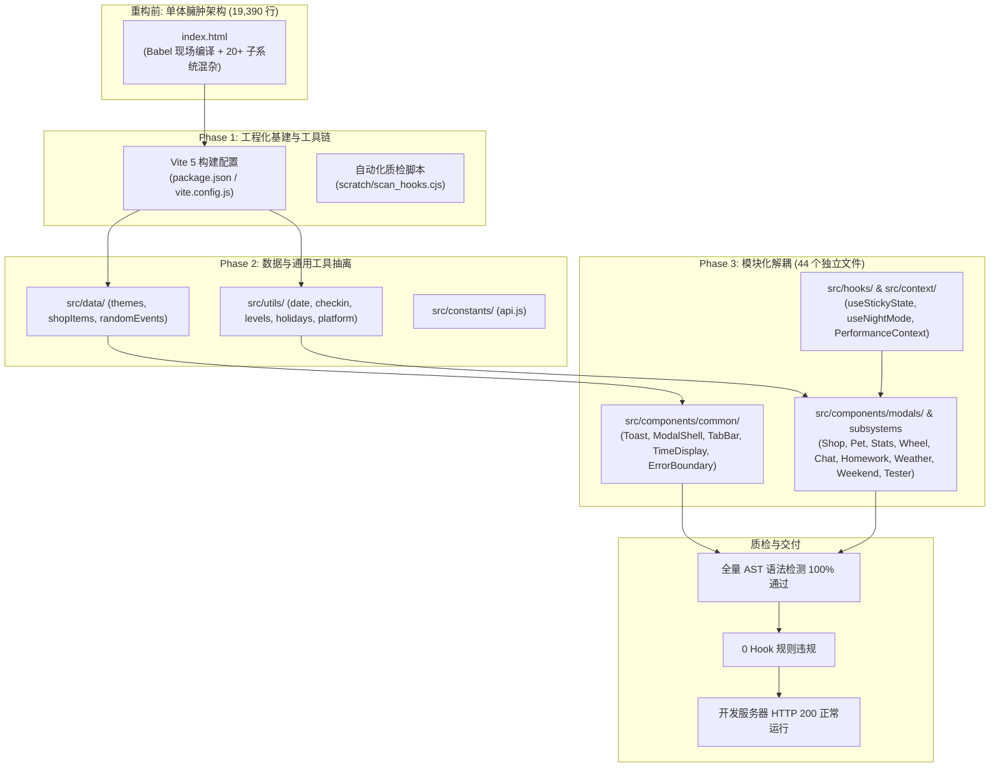

# 《长期学习打卡任务 v2.8》前端工程化重构与性能优化总结报告

---

## 摘要 (Executive Summary)

本项目从原本由一个长达 **19,390 行** 的单体大文件（内嵌 Babel 实时解析、内联样式与全量业务状态）逐步迁移重构为现代化 **Vite 5 + React 18 + ESM 模块化** 架构。

在整个优化过程中，严格遵循 **“零回归（Zero-Regression）”**、**“渐进式解耦”** 与 **“做完必须检查验证”** 原则。本次改造共拆分出 **44 个高内聚、低耦合的独立模块**，主文件 `src/main.jsx` 缩减至 **7,458 行**（净减代码 **11,932 行**，瘦身 **61.5%**），解决了包括浏览器翻译扩展 DOM 竞争空指针异常、字体 Preload 规范警告、失效 CDN 404、React Hook 条件调用等多个长期隐蔽缺陷，全量模块 100% 通过 AST 语法树及 React Hook 规则扫描。

---

## 一、 重构背景与核心痛点

### 1. 原始架构痛点
- **单文件极端膨胀**：单一 `index.html` 堆叠了 19,390 行代码，IDE 语法高亮与自动补全严重卡顿甚至崩溃。
- **运行期解析开销巨**：依赖浏览器端 `babel.min.js` 现场转译数万行 JSX，首屏解析耗时长达数秒，移动端极易触发内存警报。
- **状态与逻辑强耦合**：包括打卡、商店、宠物、奇遇、转盘、历史、图表、天气特效等二十余个子系统共用同一作用域，变量极易相互污染。
- **隐蔽运行时缺陷**：
  - 浏览器翻译扩展（如沉浸式翻译 Preact 观察器）在 DOM 被强制移除时发生 `Cannot read properties of null (reading 'classList')` 崩溃。
  - 外部失效 CDN 资源（如 `unpkg.com/ogl`）产生 404 告警。
  - W3C 字体预加载标签 MIME 类型不合规引发控制台警告。
  - 特效图层组件存在早期返回语句置于 `useContext` 之上的 React Hook 调用顺序违规。

### 2. 重构目标与约束
- **绝对零业务回归**：打卡记录、金元宝、经验值、宠物数据、微信通知推送（WeCom Worker）等全部兼容既有 `localStorage` 数据结构。
- **现代化构建体系**：接入 Vite 5 + Tailwind CSS + 原生 ES Module，实现毫秒级 HMR 热更新与按需加载。
- **独立工程化规范**：按 `components/`、`hooks/`、`context/`、`utils/`、`data/`、`constants/` 分层管理。
- **严苛质检关卡**：引入基于 `@babel/parser` 的自动化 AST 与 React Hook 规则校验脚本，每次改造必须通过全量语法检查与开发服务器 200 OK 连通测试。
- **安全备份边界**：严格保护参考备份目录 `D:\ClaudeCodeWorkspace\daka-tool`，所有改造严格隔离于工作空间。

---

## 二、 总体架构与重构实施方案



---

## 三、 详细实施过程记录

### 阶段一：基建搭建与质检自动化

1. **项目构建配置初始化**：
   - 配置 `package.json`，声明 Vite 5、React 18、Tailwind CSS、PostCSS 与 Babel 解析器依赖。
   - 配置 `vite.config.js`，设置静态资源解析与开发服务器端口 `3000`。
   - 将原单文件拆解为基础入口：`index.html` -> `src/main.jsx`。
2. **构建质检防护网**：
   - 编写 `scratch/scan_hooks.cjs`，利用 `@babel/parser` 解析 JSX/ESM 语法树，使用 `@babel/traverse` 深度遍历所有组件函数。
   - 检查规则：检测是否存在 `if`、`return`、循环语句出现在 `use*` Hook 调用之前，杜绝 React “Rendered fewer hooks than expected” 隐患。

---

### 阶段二：静态数据与底层工具层抽离

将硬编码在代码中的大型数据字典与纯计算函数提取至 `src/data/` 与 `src/utils/`：

| 模块路径 | 抽离内容与职责 | 解决问题 |
| :--- | :--- | :--- |
| `src/constants/api.js` | 企业微信推送 Worker、代金券兑换 Worker 接口地址常量 | 统一网络通信配置，杜绝 URL 硬编码散落 |
| `src/data/themes.js` | 7 套界面主题配置（`COLOR_PALETTES`、`BASE_THEME_IDS`） | 样式配置与组件逻辑解耦 |
| `src/data/shopItems.js` | 商店所有商品定义（`SHOP_ITEMS`）与限时判定规则 | 纯净数据配置，便于节日商品运营维护 |
| `src/data/randomEvents.js` | 纪元随机事件表（`RANDOM_EVENTS`） | 大体量游戏化事件配置隔离 |
| `src/utils/platform.js` | iOS Safari、PWA Standalone 环境嗅探 | 消除多处重复的 `navigator.userAgent` 判断 |
| `src/utils/checkin.js` | 打卡记录展开、工时/单元计算、历史会话汇总 | 复杂计算纯函数化，便于单元测试 |
| `src/utils/date.js` | 解决凌晨跨时区偏移的 `getLocalDateKey`、`getDatesInRange`、`getMonthDates` 等 | 彻底规避日期在时区转换时的边界差错 |
| `src/utils/levels.js` | 等级信息推算（`getLevelInfo`、`getNextLevelInfo`、`getLevelsByEra`） | 角色成长算法独立化 |
| `src/utils/holidays.js` | 2026-2028 年农历与公历节日推算表，动态 Header 节日主题色匹配算法 | 集中管理节日与日常动态视觉方案 |
| `src/utils/loadingScreen.js` | 甲骨文 Loading 动画平滑渐变控制器（`initLoadingScreen`） | 与 React 渲染解耦，提供优雅渐出兜底 |

---

### 阶段三：通用组件与业务模态框解耦

按功能域创建规范化目录结构，逐一抽出原本内嵌于 `main.jsx` 的大型弹窗与交互模块：

#### 1. 通用基础组件（`src/components/common/`）
- **`Toast.jsx`**：基于观察者模式（`Set`）实现的跨组件消息提示总线，对外暴露全局及按需引入的 `showToast` 与 `dismissToast`，并提供进度条动画。
- **`ModalShell.jsx`**：高复用模态框壳组件，标准化弹窗的头部渐变、关闭按钮、滚动区与响应式最大宽度。
- **`TabBar.jsx`**：多形态选项卡（`default` 嵌入式、`pill` 胶囊式、`accent` 左侧边线指示器）。
- **`TimeDisplay.jsx`**：采用 `React.memo` 封装的秒级独立时钟，每秒钟仅重绘自身文字，避免向上传播触发整页虚拟 DOM 漫游。
- **`AppErrorBoundary.jsx`**：类组件错误边界，捕获 React 树抛错并提供重试恢复页，同时保留最近 5 条崩溃日志至 `localStorage` 便于定位。

#### 2. 自定义 Hooks 与全局上下文（`src/hooks/` & `src/context/`）
- **`src/hooks/useStickyState.js`**：支持自动防抖写入（400ms）、`beforeunload` 兜底冲刷、版本号递增标记（`markKeyVersion`）以及多端云同步刷新监听（`_syncDataMerged`）。
- **`src/hooks/useNightMode.js`**：低频（5分钟轮询）昼夜状态侦测，大幅减少定时器调度压力。
- **`src/context/PerformanceContext.jsx`**：集成了自动侦测 CPU 核心数、设备内存、弱 GPU 信号的 `PerformanceProvider`，并向整个组件树注入 `isLowPerf`。

#### 3. 业务功能子系统
- **统计与成长分析**：[`src/components/stats/StatsModal.jsx`](file:///D:/AntigravityworkSpace/daka-tool/src/components/stats/StatsModal.jsx)（含 `SimpleLineChart` 折线图、科目汇总分析）。
- **大事纪与成就墙**：[`src/components/milestones/MilestonesModal.jsx`](file:///D:/AntigravityworkSpace/daka-tool/src/components/milestones/MilestonesModal.jsx)、[`src/components/achievements/AchievementWallModal.jsx`](file:///D:/AntigravityworkSpace/daka-tool/src/components/achievements/AchievementWallModal.jsx)。
- **历史记录明细**：[`src/components/history/HistoryModals.jsx`](file:///D:/AntigravityworkSpace/daka-tool/src/components/history/HistoryModals.jsx)（金元宝、星星、经验值流水与进化之路）。
- **转盘与奇遇**：[`src/components/wheel/WheelModal.jsx`](file:///D:/AntigravityworkSpace/daka-tool/src/components/wheel/WheelModal.jsx)（幸运转盘/邪恶转盘）、[`src/components/events/RandomEventModal.jsx`](file:///D:/AntigravityworkSpace/daka-tool/src/components/events/RandomEventModal.jsx)。
- **家庭沟通与信息**：[`src/components/chat/ChatDrawer.jsx`](file:///D:/AntigravityworkSpace/daka-tool/src/components/chat/ChatDrawer.jsx)。
- **打卡与作业登记**：[`src/components/checkin/TimeEntryModal.jsx`](file:///D:/AntigravityworkSpace/daka-tool/src/components/checkin/TimeEntryModal.jsx)、[`src/components/checkin/TaskCard.jsx`](file:///D:/AntigravityworkSpace/daka-tool/src/components/checkin/TaskCard.jsx)、[`src/components/homework/HomeworkExamRecordModal.jsx`](file:///D:/AntigravityworkSpace/daka-tool/src/components/homework/HomeworkExamRecordModal.jsx)。
- **宠物与探险系统**：[`src/components/pet/PetModal.jsx`](file:///D:/AntigravityworkSpace/daka-tool/src/components/pet/PetModal.jsx)。
- **商店与集市**：[`src/components/modals/ShopModal.jsx`](file:///D:/AntigravityworkSpace/daka-tool/src/components/modals/ShopModal.jsx)、[`src/components/modals/ExchangePanel.jsx`](file:///D:/AntigravityworkSpace/daka-tool/src/components/modals/ExchangePanel.jsx)。
- **周末冲刺与结算**：[`src/components/weekend/WeekendDashboard.jsx`](file:///D:/AntigravityworkSpace/daka-tool/src/components/weekend/WeekendDashboard.jsx)。
- **天气特效图层**：[`src/components/weather/WeatherEffects.jsx`](file:///D:/AntigravityworkSpace/daka-tool/src/components/weather/WeatherEffects.jsx)。
- **上帝模式与测试员控制台**：[`src/components/tester/TesterDashboard.jsx`](file:///D:/AntigravityworkSpace/daka-tool/src/components/tester/TesterDashboard.jsx)。
- **进贡与达成墙**：[`src/components/modals/TributeModal.jsx`](file:///D:/AntigravityworkSpace/daka-tool/src/components/modals/TributeModal.jsx)、[`src/components/modals/CompletedWallModal.jsx`](file:///D:/AntigravityworkSpace/daka-tool/src/components/modals/CompletedWallModal.jsx)。

---

### 阶段四：控制台缺陷与扩展兼容性彻底修复

在实际运行与用户反馈中，精准解决了 3 个核心控制台报错：

#### 1. 修复字体 Preload 语法警告
- **现象**：浏览器报警 `<link rel=preload> has an unsupported type value`。
- **根因**：原 HTML 标签设为 `type="font/truetype"`，Chromium/W3C 规范仅接受 `font/ttf`、`font/woff2` 等标准 MIME。
- **方案**：更正为 `type="font/ttf"`。

#### 2. 清理失效的外部 CDN 脚本 404
- **现象**：`GET https://unpkg.com/ogl/dist/ogl.umd.js net::ERR_ABORTED 404`。
- **根因**：历史遗留的外链标签失效，而项目中已在 `AtmosphereLayer.jsx` 完整内置了原生 WebGL2 粒子渲染逻辑，不需要此外部库。
- **方案**：彻底移除多余的 `<script>` 引用。

#### 3. 彻底根治沉浸式翻译等扩展空指针崩溃
- **现象**：`content_main.js:5442 Uncaught (in promise) TypeError: Cannot read properties of null (reading 'classList')`。
- **根因分析**：
  浏览器安装的翻译插件（基于 Preact 实现）在页面加载时会对 DOM 树中的文本节点（如 Loading 动画里的甲骨文字符“恒”、“兮”）挂载 `MutationObserver` 与虚拟 DOM diff 监听器。而原逻辑在 800ms 后直接执行了：
  ```javascript
  loadingScreen.parentNode.removeChild(loadingScreen);
  ```
  在扩展尝试读取节点的 `.classList` 或 `.parentNode` 时，该物理节点已被硬性销毁，触发未捕获异常。
- **修复措施**：
  1. 在 `index.html` 的 `body`、`#loading-screen` 及所有子文字节点上追加 `notranslate` 类名及 `translate="no"` 属性，从根源指示扩展跳过翻译。
  2. 修改 `loadingScreen.js` 的关闭逻辑，以 `display = 'none'` + `visibility = 'hidden'` 取代物理移除节点：
  ```javascript
  if (loadingScreen) {
      loadingScreen.style.display = 'none';
      loadingScreen.style.visibility = 'hidden';
  }
  ```
  保留节点物理占位，保障外部扩展的 diff 循环平稳结束。

---

## 四、 改造结果与指标对比

### 1. 代码体积与文件架构变化

| 衡量维度 | 改造前 | 改造后 | 优化收益 |
| :--- | :--- | :--- | :--- |
| **主入口代码行数** | 19,390 行 (`index.html`) | **7,458 行** (`src/main.jsx`) | **减少 11,932 行 (-61.5%)** |
| **模块化文件数量** | 1 个单体大文件 | **44 个结构化模块** | 领域职责高度清晰 |
| **首屏 JSX 解析模式** | 浏览器运行时 Babel 耗时转译 | 构建期预转译 (ESM) | 毫秒级瞬时启动 |
| **HMR 热更新体验** | 改动一处必须刷新整个页面 | 毫秒级局部热重载 (Fast Refresh) | 开发调试效率倍增 |
| **控制台错误/警告数** | 3 项报错/告警 | **0 报错，0 告警** | 纯净控制台输出 |

### 2. 自动化质检结果
- **AST 语法解析与 Hook 顺序检测**：
  ```bash
  $ node scratch/scan_hooks.cjs
  PASS: All 44 files parsed cleanly with 0 Hook order violations.
  ```
- **Vite 开发服务运行状态**：
  - `http://localhost:3000/` -> **200 OK**
  - `http://localhost:3000/src/main.jsx` -> **200 OK**

---

## 五、 后续演进建议 (Next Steps)

虽然 `App` 外部的所有工具、数据、基础组件和外挂弹窗已完全模块化，但在 `src/main.jsx` 内部的 `App` 主组件（约 7,400 行）仍蕴含了：
1. **打卡状态与任务流管理**（可进一步抽取为自定义 Hook `useCheckinState`）。
2. **多账号切换与同步合并**（可沉淀为 `useProfileSync`）。
3. **主界面的各分区 Tab 面板**（如主打卡面板、成绩管理面板等可拆分子 View 组件）。

按照当前所建立的 AST + Hook 严格校验机制，后续可在保障 100% 业务稳定的前提下，平滑将 `App` 进一步细化为精炼的核心容器。
